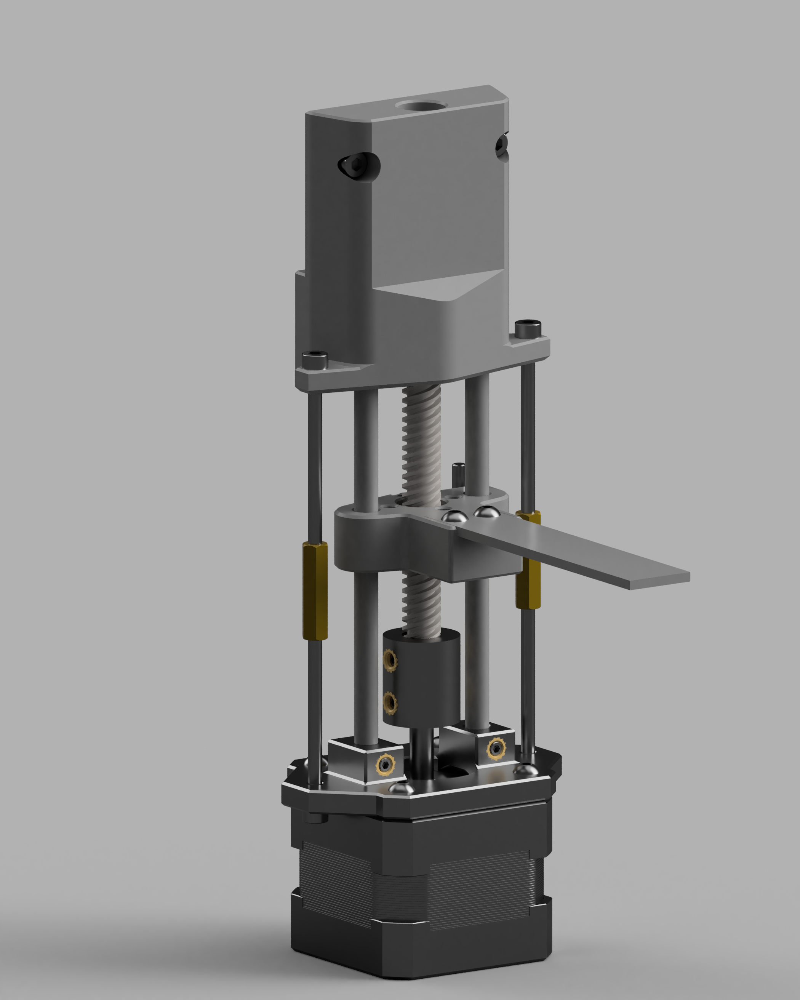
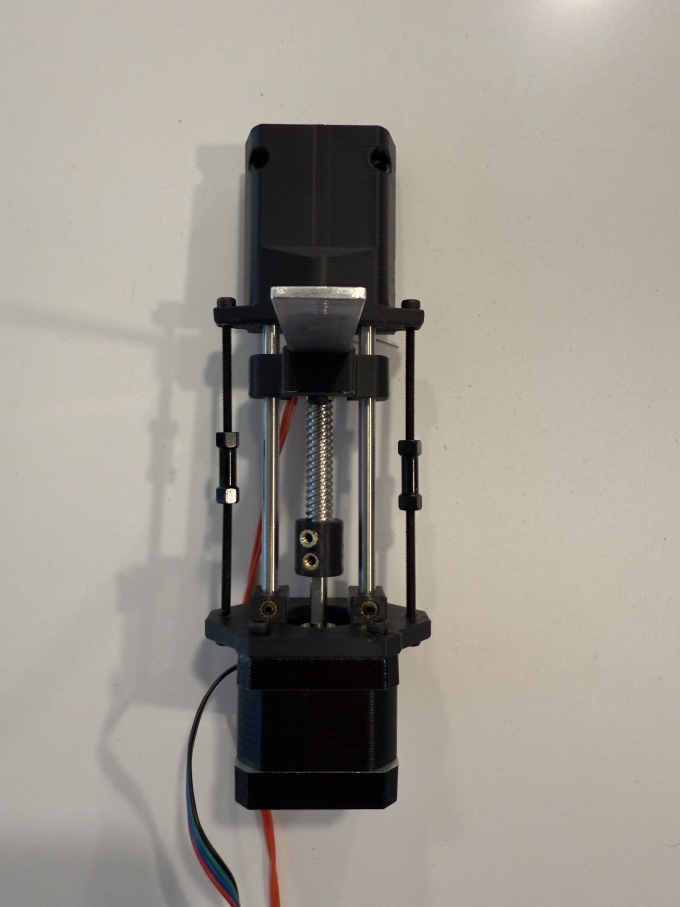
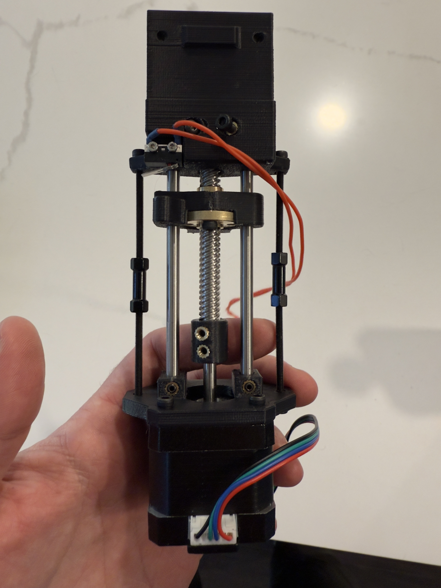

# Gantry-Attached Blobifier
## A variant of Blobifier for fixed XY gantry printers

First of all, this variant is based heavily on the "[Blobifier_X](https://github.com/xuanyuanss/Blobifier_X)". Credit to the originator for a great idea!

The Blobifier hardware is wholly incompatible with fixed gantry printers such as the Voron Trident.

There are variations of the "software" that the Blobifier uses to operate that allow one to purge blobs onto the bed and then kick them off. However, this method poses similar and additional issues that are present in the original Blobifier.

1. An area of the build plate is lost/reserved for purging in both the original Blobifier (primarily for toolhead clearance) and the Trident/SW variant of blobbing on the build plate.
1. The Trident/SW variant has a further limitation due to the need to raise the bed/lower the X-axis gantry to bed which either limits the height of parts to the height of the toolhead below the gantry or makes it not possible to use the Blobifier for parts taller than that dimension.

While attempting to implement the Blobifier_X, I found that the unipolar stepper motor (despite "conversion" to a bipolar stepper) was inadequate for the task and tempermental. Therefore, I decided to make some modifications to the original design to enable the use of a NEMA 17 stepper that I had laying around.

> Note: While I designed this for my Trident, the original designer designed theirs for the V2. Therefore, this could in theory be used for a V2 also. However, there are certain design considerations that would need taken into account for this version to work effectively with a V2. Primarily, overall height of the setup would need to be closely considered to allow the gantry to still reach the build plate. The weight is also a factor to consider. However, the advantage of not losing build area may be worth it.

# Images

# In Action
<video src="https://youtu.be/DP9UL1YaNPk" width="600"></video>

# Bill of Materials:
- 1x NEMA 17 stepper motor, I do not think that the size is important since the assembly is relatively light, so opt for the smallest variant you have on hand.
- 1x TMC2209 or any bipolar stepper motoro driver
- 2x ∅5x100mm steel dowel
	- I used 100mm length, but this can be tuned to your setup. 100mm works well with the Reaper Toolhead using a Rapido UHF hotend where the nozzle tip sits ~49mm below the bottom side of the gantry extrusion.
- 1x 100mm T8 lead screw with nut
	- Again, the length can be changed for your setup. There is some forgiveness in the length since the top side is not fixed in place
	- Generally, the length should be the same as the length of the dowels you chose.
- 1x D2F-L1 micro switch, knockoff Omrons work too
- Some amount of M3x4x5 heatset inserts (~12? ¯\\_(ツ)_/¯)
- 4-8x M3x3 set screws
	- Minimum 4 if you decide to print the coupler, optional additional 4 (8 total) if you want to use set screws for attach the stepper mount to the rods.
- 2x M3x12 SHCS for attaching to 2020 extrusions
- 2x t-nuts for 2020 extrusion attachment
- 4x M3x8 BHCS or SHCS for attaching stepper to stepper mount
- 2x M3x12 BHCS for securing rods to main body
	- Could use longer set screws too
- 1x M3x? BHCS or SHCS for endstop positioning
	- Length is variable because it depends on your setup
- 2x M3x6 BHCS or SHCS for mounting tray to slider
- 4x M3x40mm BHCS or SHCS for support rods
	- Length of these will depend on the length of the dowels that you choose and the length of spacer you have.
	- Generally, the length of the screws should be less than half the length of the rods (recommend (length_of_rod/2)-10) and choose spacer appropriately.
- 2x M3x25mm spacer for mating the support bolts together
	- Strictly speaking, these and the 40mm bolts may not be necessary, but I added them as a backup in the event that the screws holding the rods in place backed out over time from vibrations. You can add loctite to these, I would not recommend adding loctite to the screws holding the rods. 
- 1x 15x2x?mm aluminum bar for tray
	- You want this long enough to extend about 4-5mm past nozzle when nozzle parked over tray.
	- I suggest buying longer than needed and cutting to length once you have everything mocked up.
	- Drill holes into bar as shown below
- Masking tape, aids in adherence of blob to tray. Other methods could also work, this just worked for me.

# Key Assembly Instructions
- If using printed coupler, I suggest installing the stepper mount shaft and T8 rod into coupler and then pressing the heatset insert all the way until it stops against the shaft/rod.
- Assemble the main body and the stepper motor mount with the rods, then install the T8 shaft with the coupler onto the stepper motor before attaching stepper to the mount.

# Setup Instructions
## Basic Configuration
- Copy blobifier_trident.cfg and blobifier_trident_hw.cfg to config folder.
- Update the pin definitions, rotation distance, etc. in blobifier_trident_hw.cfg to match your setup.
- Check the stepper motor direction by manually putting the slider in the middle of the travel, then run MANUAL_STEPPER STEPPER=blobifier MOVE=5. If the slider moves away from the microswitch (down), then the direction is correct. Otherwise, invert the DIR pin in the blobifier_trident_hw.cfg.
## Home Position Setting
- Install the bumpstop screw into slider if you have not already
- Manually adjust the slider position such that the tray sits approximately 0.2 - 0.6mm below the nozzle.
	- Recommended to move the toolhead manually into position.
- Adjust the bumpstop screw until you hear the microswitch click.
- Move the toolhead clear of the tray
- Run BLOBIFIER_RESET, then MANUAL_STEPPER STEPPER=blobifier MOVE=5 to move the slider away from the microswitch. Then run BLOBIFIER_HOME. The slider should move up and then stop when the microswitch is activated.
- Move the toolhead back over the tray (careful to make sure that it does not collide with the tray) and check the distance between the nozzle and the tray. If the distance is still ~0.2 - 0.6mm, then no more adjustment is needed. 
	- If it is too close to the nozzle or the nozzle would collide with the tray, then run BLOBIFIER_RESET and MANUAL_STEPPER STEPPER=blobifier MOVE=5 again, thread the bumpstop screw in further, run BLOBIFIER_HOME again, then check the distance again.Repeat as necessary.
	- If the tray is too far away, loosen the bumpstop screw enough that you think it will provide the necessary gap (M3 screws have a 0.5mm pitch, so one turn/rev = 0.5mm in linear distance). Run BLOBIFIER_RESET then MANUAL_STEPPER STEPPER=blobifier MOVE=5 and then BLOBIFIER_HOME again. Check the distance. Repeat as necessary._
- Once you are confident that the nozzle is at a good distance and will not collide with the tray, then home the XY axes and move the nozzle over the tray, making sure to center it as best as possible. Record the X and Y coordinates (the Y coordinate is usually the same as the axis maximum). These coordinates correspond to the purge_x and purge_y variables in the blobifier_trident.cfg.
- Additionally, define the kick_ready_x, kick_x, and kick_y coordinates.
	- The kick_ready_x position should be to the left or right of the purge_x position and provide enough distance to build up to the blob_kick_spd you set in the config.
	- The kick_x position must at least be the same as purge_x in order to contact the blob on the tray. I set mine a bit past it (to left of purge_x if my kick_ready_x is to the right) to follow through on the kick to make sure I make contact.
	- If you are kicking with the nozzle silicone sock, then kick_y will be the same as the purge_y value. If you are kicking with something else (I use the part of my beacon where it mounts to the carriage, more rigid and generally cheaper/easier to replace than a hotend if something bad were to happen...), then you will input a kick_y position that works for you.
- Finally, go through the BLOBIFIER gcode variables and set the other variables as necessary. Many of them are the same as the OG [Blobifier](https://github.com/moggieuk/Happy-Hare/blob/main/config/addons/blobifier.cfg) variables found in the Happy Hare repo.

# Printing Suggestions
- Standard Voron printing profile should be sufficient.
- The print orientation of the stls is not guaranteed. However, the orientation should like the image below. The slider has a built in support that can be removed easily by slotting a flat head in the gap and twisting.
- 
	- Note that the coupler (if you choose to use it) should be printed with the 5mm end down on the build plate.

# Other Considerations
- The originator of the [Blobifier_X](https://github.com/xuanyuanss/Blobifier_X) also includes a kick attachment for Stealthburner toolheads. However, if you are using Filametrix, then it will be incompatible as it mounts to one of the mounting points used by Filametrix.
- Thank you to the Blobifier_X creator for laying the groundwork for this project.
- Thank you to @Dendrowen for his original creation of the Blobifier.