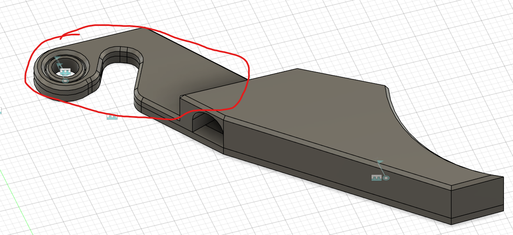
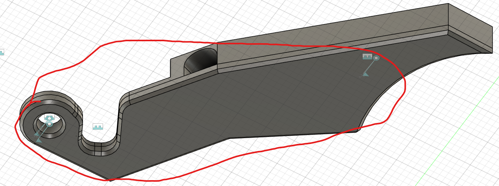

These files are still in testing more or less. CAD says that they will work, but the cutter arm parts have yet to be printed and tested.

That being said, please let me know if you find any issues!

## Cutter Arm Improvements
- Depressor arc implemented to hopefully enable smoother cutter action. I found that the original cutter arm design was very noisy.
	- This design was also chosen to work better with the two-dimensional cutter action that I coded into Happy Hare for these types of cutters.
		- This has not been released, but the details can be found [here](https://github.com/moggieuk/Happy-Hare/pull/607) if you wish to test it out!
- The pin behind the opening for the blade was also eliminated as the iterations that I have tested were consistently failing there.
	- The indexing points are not a ring around the pivot pin in the arm bottom part and another pin about where the original was.
- I was not able to figure out a way to not use super glue to attach the two halves together, so that is still the recommended method of construction.

## Other notes about assembly
- Once you have the two halves and the cutter arm installed, I would press the two halves together (a vice would be handy here) and check the motion of the arm. If it is binding, then I would suggest sanding the top and bottom surfaces of the cutter arm that fall within the gap in the top and bottom housing. You want it to move freely so that it can spring back after the cut.
	-  

## Gantry-mounted servo
- The gantry-mounted servo file is a slight remix of this [one](https://www.thingiverse.com/thing:6584232) with a bolt hole spacing of 41.5mm to work with my gantry backers
- The servo arm depressor is a mix of the arm from [here](https://www.thingiverse.com/thing:6584232) and the pushbar from [here](https://www.printables.com/model/1142687-filament-cutter-for-reaper-toolhead-and-orbiter-pa/files) so that I could save some bed space.