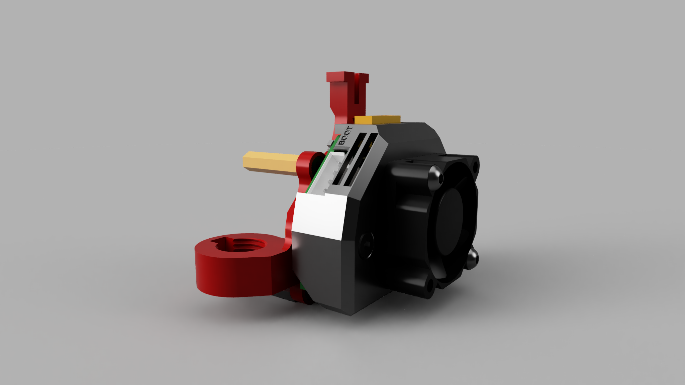
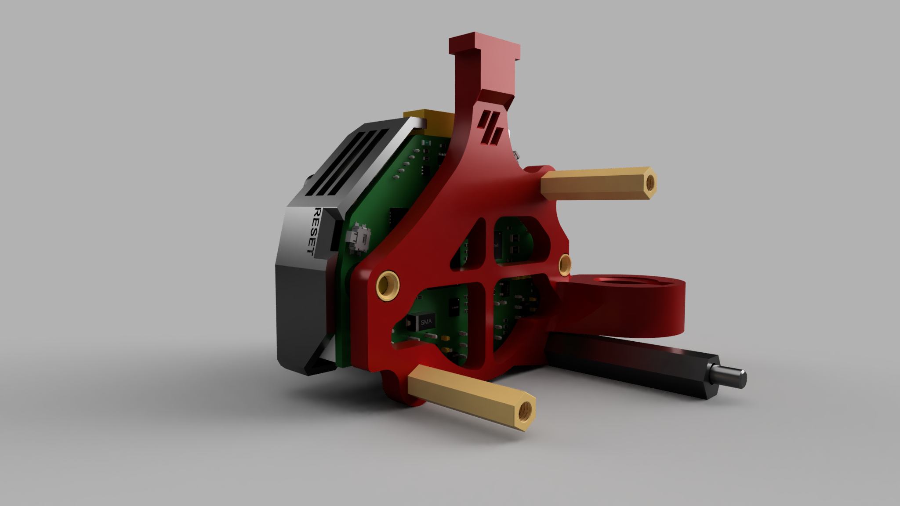

## LDO NiteHawk 36 V1.4 Board Mount for WWG2 with PG7

This mount is basically a remix of this [PG7 mount](https://github.com/tetsu97/WristWatch-G2-Extruder/blob/main/STLs/CANBoard_Mounts/CANBoard_Mount2(PG7)_nospacer.stl) with an added third mounting point for WWG2. There are added spacers to distance the board from the mount. I have also made some other slight modifications that make it more compatible with NiteHawk 36 V1.4.

The mount also features a PTFE tube strain relief/piano wire mount point that was inspired by @hartk1213's [NH36 mount](https://github.com/hartk1213/MISC/tree/main/Voron%20Mods/Extruders/nitehawk36_mount_and_cover). I mainly use it on my Trident as a place to mount the piano wire that I zip tie my umbilical to.

I have also created a cover specific to NH36 V1.4 with a fan mount incorporated (as we know that these boards do not like high temperatures...).

---
