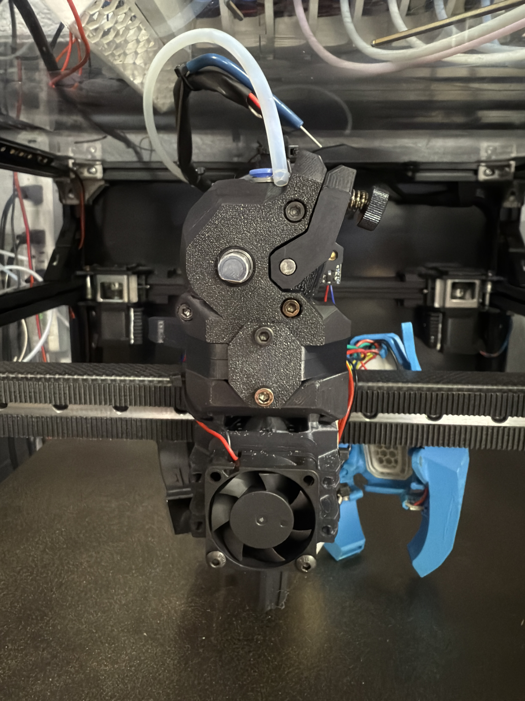

## List of Mods
 - [WWG2 Dual Sensor Front Body coupling plate mount](WWG2_Dual_Sensor_Front_Body_coupling_plate_mount.stl) is a modification of the WWG2 front body by bythorsthunder found [here](https://github.com/bythorsthunder/Voron_Mods/tree/main/Wristwatch_G2_Dual_Filament_Sensor) with the addition of a mounting point for the "Extruder Coupling Plate" found in this folder.
 - [Extruder Coupling Plate](Extruder_Coupling_Plate.step) is a modification to create a third mounting point for the WWG2 extruder to the hotend mount of the Reaper toolhead that uses the Xol mount pattern.
	- Here is a picture of the coupling plate: 
 - [Cutter](Cutter) folder contains parts for a cutter mod that were derived from this [cutter](https://www.printables.com/model/1142687-filament-cutter-for-reaper-toolhead-and-orbiter-pa) by @mental808.
	- All parts have been modified for better functionality as a XY cutter mechanism.
	- V2 parts use an updated cutter arm that is hopefully more robust.
		- Bottom V2 is slightly taller (0.3mm) to eliminate need to sand cutter arm during assembly as well.
	- The parts were modeled to better align with the profile of the WWG2 and Reaper hotend mount as well as shave off 4 mm in overall height.
	- At some point I will add some more tips and tricks that I learned with the cutter installation on Reaper when I get time.
